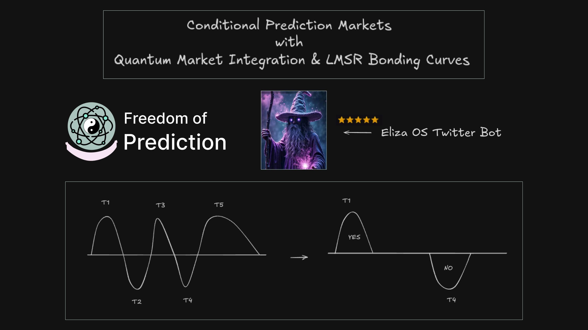
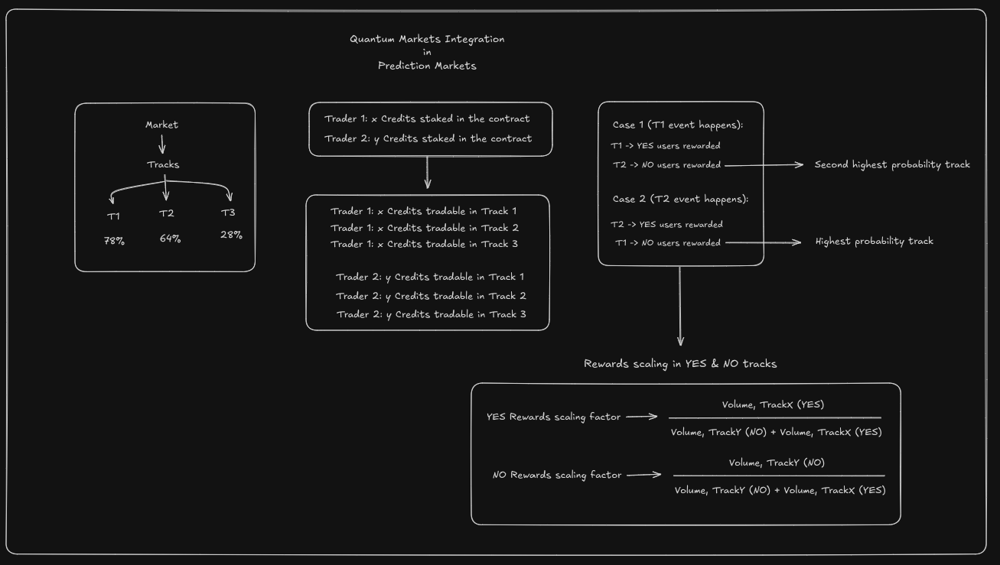
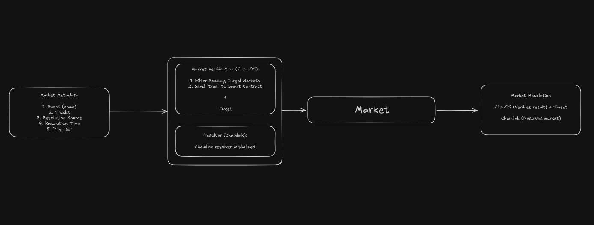
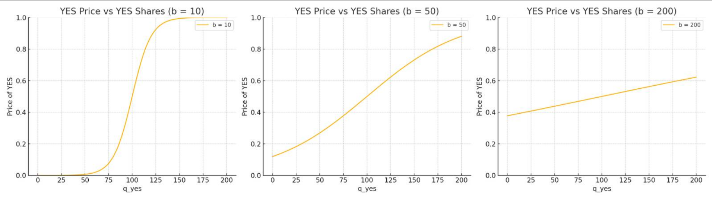
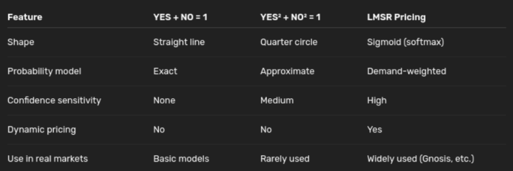
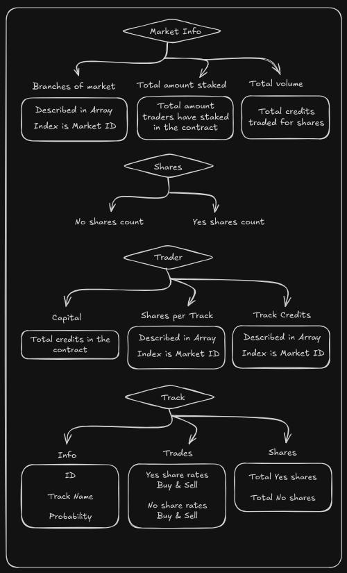
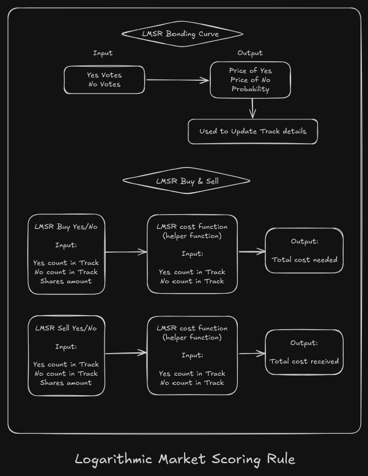
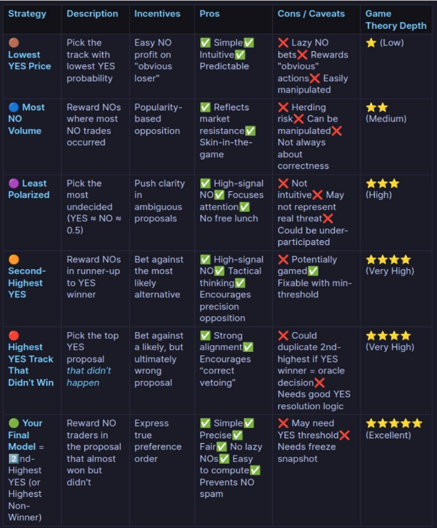
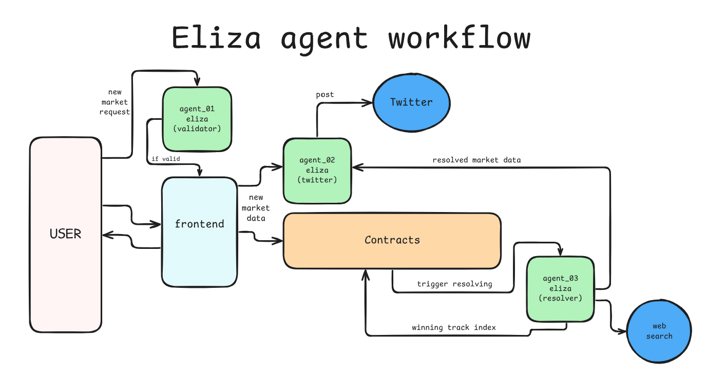

# Freedom-of-prediction

### **Freedom of Prediction but not from Constitution**


## ⚛️ World's First Quantum Markets Implementation ⚛️

A decentralized prediction market platform featuring the **first ever implementation of quantum markets** - a groundbreaking approach that leverages conditional probability markets and **LMSR bonding curves** to create multi-dimensional prediction scenarios.

### Key Features
- **Quantum Markets**: Revolutionary implementation allowing for interconnected, conditional outcome predictions
- **Eliza OS Integration**: AI agents for autonomous market verification and resolution
- **Social Media Integration**: Automated posting of market status and results to **Twitter** for public transparency
- **Blockchain Oracle**: **Chainlink** services providing reliable data feeds and automation






<div style="display: flex; flex-wrap: wrap; gap: 10px; justify-content: center;">
  
  
</div>

<div style="display: flex; flex-wrap: wrap; gap: 10px; justify-content: center;">

</div>

### Some links
- [YouTube Demo Video](https://youtu.be/bgQiFNYzsFY)
- [Twitter Bot](https://x.com/predictor_85882)
- [Github](https://github.com/nikillxh/freedom-of-prediction)

# Frontend

ToDO

# Backend - eliza agent



## How To Run

```bash
cd eliza-backend
```

### validator agent (port - 4000)
```bash
cd eliza-validator
pnpm i
pnpm build
pnpm start --characters="characters/predictorx.character.json"
```


### twitter agent (port - 4001)
```bash
cd eliza-twitter
pnpm i
pnpm build
pnpm start --characters="characters/posterx.character.json"
```

### resolver agent (port - 4002)
```bash
cd eliza-resolver
pnpm i
pnpm build
pnpm start --characters="characters/resolverx.character.json"
```

### Testing agent
```bash
cd test-agent
npm i
tsc testAgent.ts
node testAgent.js
```