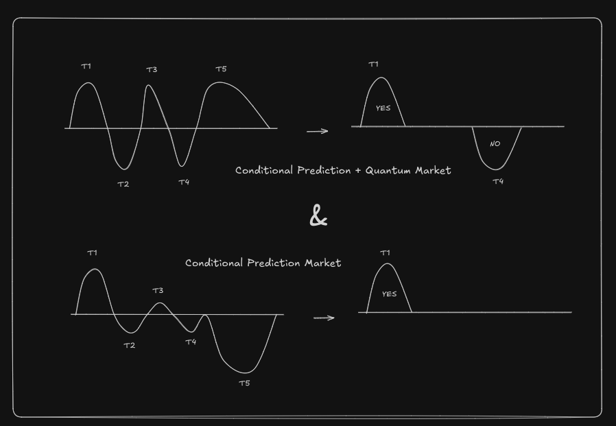
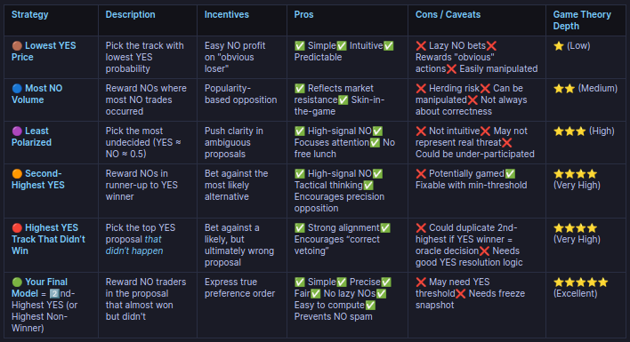

# Freedom-of-prediction

### **It's Freedom of Prediction but not by the Constitution**


## ⚛️ World's First Quantum Markets Implementation ⚛️

A decentralized prediction market platform featuring the **first ever implementation of quantum markets** - a groundbreaking approach that leverages conditional probability markets and **LMSR bonding curves** to create multi-dimensional prediction scenarios.

### Key Features
- **Quantum Markets**: Revolutionary implementation allowing for interconnected, conditional outcome predictions
- **Eliza OS Integration**: AI agents for autonomous market verification and resolution
- **Social Media Integration**: Automated posting of market status and results to **Twitter/X** for public transparency
- **Blockchain Oracle**: **Chainlink** functions for communicating with external functions for data

### The Analogy with Conditional Prediction Markets


### Working Mechanism


### Platform Structure


### LMSR Bonding Curves


### Bonding Curves Comparison


### Market Variables
<div style="display: flex; flex-wrap: wrap; gap: 10px; justify-content: center;">
  
  
</div>

### The NO track victory analysis


### Some links
- [YouTube Demo Video](https://youtu.be/bgQiFNYzsFY)
- [Twitter Bot](https://x.com/predictor_85882)
- [Github](https://github.com/nikillxh/freedom-of-prediction)

## Frontend

Check out `prediction` folder!

## Backend - eliza agent


### How To Run

```bash
cd eliza-backend
```

### validator agent (port - 4000)
```bash
cd eliza-validator
pnpm i
pnpm build
pnpm start --characters="characters/predictorx.character.json"
```


### twitter agent (port - 4001)
```bash
cd eliza-twitter
pnpm i
pnpm build
pnpm start --characters="characters/posterx.character.json"
```

### resolver agent (port - 4002)
```bash
cd eliza-resolver
pnpm i
pnpm build
pnpm start --characters="characters/resolverx.character.json"
```

### Testing agent
```bash
cd test-agent
npm i
tsc testAgent.ts
node testAgent.js
```

## Analysis
### Problems Solved
1. Decentralized Market Creation for preventing centralization during Market Creation.
2. World's first Quantum Market implementation, integrated with Conditional Prediction Market to solve the problem of capital requirement & making better use of capital for prediction by enabling users to model opinions in each track of a Market by using the total capital staked in the Market for each track individually!
3. Unique Market Resolution Mechanism, valuing both, the "YES" & "NO" tracks in the market instead of just "YES" or "NO", leading to better prediction, as users have to model their opinions properly for each track (instead of buying in only one track) for getting rewarded.
4. Used ElizaOS for Twitter/X tweet on Market Creation & Market Resolution. 
5. Decentralized Market Resolution powered by Eliza OS bridged with Chainlink function.
6. LMSR bonding curves instead of the classic Linear or Quarter Circle curves. Leading to better market manipulation resistance & better prediction.
7. A completely Permissionless & Decentralized Conditional + Quantum Prediction Market!

### Challenges Faced
1. Integrating elizaos was pretty tough, needed to used eliza-starter kit which had limited options, in contrast to elizaos-cli version.
2. Twitter bot was challenging, aligning the agent to post only the data which is essentioal was quite difficult.
3. Inventing a completely new market resolution mechanism for this unique market & better incentivization of future prediction.
4. Chainlink functions work fine on Sepolia. Faced difficulty setting up & running Chainlink functions on Localhost.